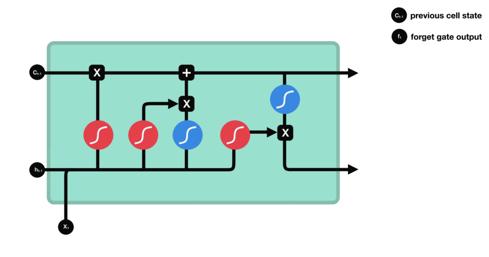

# 常见问题

> 整理、收集自网上资源

## 1. 使用cuda出现问题的解决方式

```bash
sudo ldconfig /usr/local/cuda-9.0/lib64
sudo ln -sf /usr/local/cuda-9.0/lib64/libcudnn.so.7.0.5 /usr/local/cuda-9.0/lib64/libcudnn.so.7
```

## 2. 找不到自己写的模块

**在代码入口处加入一下代码：**

```python
import sys
sys.path.append('/project_path/module')
```

## 3. CNN的feature map计算方式


## 4. RNN cell如何计算隐藏状态？


## 5. LSTM中各种门的作用？

LSTM 的核心概念在于**细胞状态**以及“**门**”结构。细胞状态相当于信息传输的路径，让信息能在序列连中传递下去。可以将其看作网络的“记忆”。理论上讲，细胞状态能够将序列处理过程中的相关信息一直传递下去。

LSTM 有三种类型的门结构：遗忘门、输入门和输出门。

**遗忘门**

遗忘门用于决定应丢弃或保留哪些信息。来自前一个隐藏状态的信息和当前输入的信息同时传递到 sigmoid 函数中去，输出值介于 0 和 1 之间，越接近 0 意味着越应该丢弃，越接近 1 意味着越应该保留。



**输入门**

输入门用于更新细胞状态。首先将前一层隐藏状态的信息和当前输入的信息传递到 sigmoid 函数中去。将值调整到 0~1 之间来决定要更新哪些信息。0 表示不重要，1 表示重要。

其次还要将前一层隐藏状态的信息和当前输入的信息传递到 tanh 函数中去，创造一个新的侯选值向量。最后将 sigmoid 的输出值与 tanh 的输出值相乘，sigmoid 的输出值将决定 tanh 的输出值中哪些信息是重要且需要保留下来的。


**细胞状态**

下一步，就是计算细胞状态。首先前一层的细胞状态与遗忘向量逐点相乘。如果它乘以接近 0 的值，意味着在新的细胞状态中，这些信息是需要丢弃掉的。然后再将该值与输入门的输出值逐点相加，将神经网络发现的新信息更新到细胞状态中去。至此，就得到了更新后的细胞状态。


**输出门**

输出门用来确定下一个隐藏状态的值。首先，我们将前一个隐藏状态和当前输入传递到 sigmoid 函数中，然后将新得到的细胞状态传递给 tanh 函数。

最后将 tanh 的输出与 sigmoid 的输出相乘，以确定隐藏状态应携带的信息。再将隐藏状态作为当前细胞的输出，把新的细胞状态和新的隐藏状态传递到下一个时间步长中去。


## 6. 如何解决样本不均衡的问题

**1. 产生新数据型：过采样小样本(SMOTE)，欠采样大样本。**SMOTE，通过插值的方式加入近邻的数据点。

**2. 对原数据的权值进行改变**

**3. 通过组合集成方法解决**

**4. 通过特征选择**

## 7. Dropout为什么能解决过拟合问题？

过拟合，可以通过阻止某些特征的协同作用来缓解。在每次训练的时候，每个神经元有百分之50的几率被移除，可以让一个神经元的出现尽量不依赖于另外一个神经元。

另外，可以把dropout理解为模型平均。

如果采用dropout，训练时间延长。dropout在数据量比较小的时候，不建议使用，效果并没有特别好，dropout的值一般来说取值为0.5。